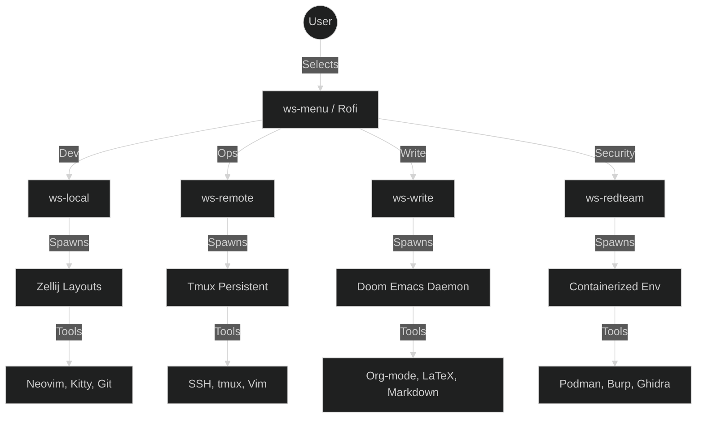

<div align="center">

<!-- Hero Banner -->


# 🚀 S1Bs1stem
**Advanced Automation System for Arch Linux + DWM**

 [](https://archlinux.org)
 [](https://github.com/ind4skylivey/s1barch/releases)
 [](LICENSE)
 [](https://github.com/ind4skylivey/s1barch)
 [](https://dwm.suckless.org/)
 [](https://zellij.dev)
 <br/>
 [](https://github.com/ind4skylivey/s1barch/actions/workflows/shellcheck.yml)
 [](https://github.com/ind4skylivey/s1barch/actions/workflows/security.yml)
 [](https://github.com/ind4skylivey/s1barch/actions/workflows/integration.yml)

[🚀 Quick Install](#-quick-install) • [📖 Documentation](docs/) • [🐛 Report Bug](https://github.com/ind4skylivey/s1barch/issues)

A complete orchestration layer for Arch Linux, seamlessly integrated with [dotfiles-s1b](https://github.com/ind4skylivey/dotfiles-s1b).

</div>

---

## 📑 Table of Contents

- [⚡ About](#-about)
- [🧠 Eco-Workflow Architecture](#-eco-workflow-architecture)
- [✨ Features](#-features)
- [📊 Technical Specifications](#-technical-specifications)
- [🌌 Environment Selection](#-environment-selection)
- [🚀 Quick Start](#-quick-start)
- [🏗️ Project Structure](#-project-structure)
- [🔧 Installation](#-installation)
- [📚 Usage](#-usage)
- [🧠 Workflows](#-workflows)
- [🎨 Customization](#-customization)
- [🐛 Troubleshooting](#-troubleshooting)
- [🗺️ Roadmap](#-roadmap)
- [🤝 Contributing](#-contributing)
- [📝 License](#-license)

---

## ⚡ About

**S1Bs1stem** is more than dotfile configurations; it's a **complete orchestration layer** designed for developers, security researchers, and Linux users seeking a minimalist yet highly functional environment.

Built from the ground up to provide a reproducible, automated installation of a complete Arch Linux desktop environment with DWM (Dynamic Window Manager).

### Integration with dotfiles-s1b

This project works seamlessly with [dotfiles-s1b](https://github.com/ind4skylivey/dotfiles-s1b), providing the orchestration and automation layer while dotfiles-s1b provides the actual configuration files and themes.

```
S1Bs1stem (Orchestration) + dotfiles-s1b (Configurations) = Complete System
```

> [!TIP]
> **Core Philosophy**
> *Minimal intrusion, maximum reproducibility. Tools should adapt to the user's intent, not the other way around.*

### Core Philosophy

| Principle | Description |
|:---|:---|
| **🎯 Minimal Intrusion** | Tools should adapt to user intent, not the other way around |
| **🔄 Maximum Reproducibility** | Modular scripts and robust validation |
| **🛡️ Safety First** | Pre-flight checks, rollback system, and advanced logging |
| **🌐 Eco-Workflow** | Context-aware sessions (Local, Remote, Write, RedTeam) |

---

## 🧠 Eco-Workflow Architecture

The heart of this setup is the **Orchestration Layer**. Instead of launching tools directly, you launch **Contexts**.

<div align="center">



</div>

<div align="center">

| Context | Command | Engine | Purpose |
|:---:|:---:|:---:|:---|
| **Development** | `ws-local` | **Zellij** | Coding, file management, and local testing. |
| **Infrastructure** | `ws-remote` | **Tmux** | Persistent SSH sessions and server management. |
| **Deep Work** | `ws-write` | **Emacs** | Distraction-free writing and Org-mode planning. |
| **Red Team** | `ws-redteam** | **Docker** | Isolated environments for security research/CTF. |

</div>

> [!NOTE]
> **Learn more:** Read the full [Eco-Workflow Guide](docs/Workflows.md).

---

## ✨ Features

### Orchestration System

<div align="center">

| Feature | Status | Description |
|:---|:---:|:---|
| **Pre-flight Validation** | ✅ Complete | Complete verification before installation |
| **State Management** | ✅ Complete | Resume capability - continue where you left off |
| **Retry Loops** | ✅ Complete | Scripts fail with automatic retries |
| **Interactive Mode** | ✅ Complete | Interactive mode for greater control |
| **Dry-run Mode** | ✅ Complete | Preview of actions without executing anything |
| **Rollback System** | ✅ Complete | Snapshots and configuration restoration |

</div>

### Hardware Detection System

<div align="center">

| Detection | Method | Scripts Using |
|:---|:---:|:---:|
| **Battery** | `upower -e` | Battery scripts (auto-skip on desktop) |
| **Lid** | `/proc/acpi/button/lid/` | Lid handling (auto-skip on desktop) |
| **Audio System** | `pactl info`, `pw-cli` | All audio scripts |
| **DWM Running** | `pgrep dwm` | DWM-specific scripts |
| **Waybar Running** | `pgrep waybar` | Waybar scripts |

</div>

### Automation Scripts

<div align="center">

| Category | Scripts | Description | Status |
|:---|:---:|:---:|:---:|
| **🎵 Audio** | 5 scripts | Volume, mic, output switching (PipeWire/PulseAudio) | ✅ |
| **🔋 Battery** | 6 scripts | Monitor, notify, power saver, lid handling, charge limiter | ✅ |
| **🖼️ Display** | 2 scripts | Screenshot (4 modes), wallpaper cycling | ✅ |
| **🪟 DWM** | 4 scripts | Window control, rules, autostart (desktop/laptop profiles) | ✅ |
| **🌐 Networking** | 7 scripts | Status, meter, DNS, VPN, WiFi, Tailscale, iPhone VNC | ✅ |
| **⚙️ System** | 7 scripts | Cleanup, disk usage, logs, maintenance, packages, services, info | ✅ |

</div>

---

## 📊 Technical Specifications

### System Requirements

<div align="center">

| Requirement | Minimum | Recommended |
|:---|:---|:---|
| **Operating System** | Arch Linux | Arch Linux / CachyOS |
| **RAM** | 4GB | 8GB+ |
| **Storage** | 5GB free | 20GB+ SSD |
| **Shell** | ZSH or Fish | ZSH |
| **Window Manager** | DWM | DWM (patched) |

</div>

### Tech Stack

| Component | Technology | Version |
|:---|:---|:---:|
| **Window Manager** | DWM | 6.4+ |
| **Terminal** | Kitty / Alacritty / Warp | Latest |
| **Shell** | ZSH / Fish | 5.8+ / 3.6+ |
| **Multiplexer** | Zellij / Tmux | Latest |
| **Editor** | Neovim / Doom Emacs | 0.9+ / 29+ |
| **Theme** | Catppuccin | Mauve |
| **Language** | Bash | 4.0+ |

---

## 🚀 Quick Start

### Prerequisites

<div align="center">

| Requirement | Details |
|:---|:---|
| **🐧 OS** | Arch Linux (or Arch-based like CachyOS) |
| **🪟 WM** | DWM installed |
| **🐚 Shell** | ZSH or Fish shell |
| **🌐 Network** | Internet connection |
| **💾 Storage** | Minimum 5GB of free space |

</div>

### One-Line Installation

```bash
bash <(curl -fsSL https://raw.githubusercontent.com/ind4skylivey/s1barch/main/install.sh)
```

### Manual Installation

```bash
# 1. Clone repository
git clone https://github.com/ind4skylivey/s1barch.git ~/Desktop/S1Bs1stem

# 2. Navigate to directory
cd ~/Desktop/S1Bs1stem

# 3. Run orchestrator
./install/ORCHESTRA.sh
```

### Post-Installation

```bash
# 1. Logout and login (apply shell)
# 2. Restart DWM
# 3. Run verification
s1b-doctor
```

> [!TIP]
> **First Steps:** After installation, run `ws-menu` to launch the workflow menu and select your first context.

---

## 🏗️ Project Structure

```
S1Bs1stem/
├── install/                      # Installation system
│   ├── ORCHESTRA.sh            # Master script (conductor)
│   ├── preflight/               # Pre-flight checks
│   ├── modules/                  # Installation modules
│   ├── post_install/             # Post-installation
│   └── rollback/                # Rollback system
├── scripts/                     # All organized scripts
│   ├── common/                  # Common libraries
│   ├── audio/                   # Audio scripts
│   ├── battery/                 # Battery scripts
│   ├── display/                 # Display scripts
│   ├── dwm/                    # DWM scripts
│   ├── networking/              # Network scripts
│   ├── system/                  # System scripts
│   └── workflow/                # Eco-Workflow scripts
├── docs/                        # Documentation
├── tests/                       # Test suite
└── README.md                    # This file
```

---

## 🔧 Installation

### Installation Modes

<div align="center">

| Mode | Command | Description |
|:---|:---|:---|
| **Normal** | `./install/ORCHESTRA.sh` | Interactive environment selection menu |
| **Interactive** | `./install/ORCHESTRA.sh --interactive` | Prompt before each script |
| **Dry-run** | `./install/ORCHESTRA.sh --dry-run` | Preview without executing |
| **Reset** | `./install/ORCHESTRA.sh --reset` | Reset installation state |
| **Verbose** | `./install/ORCHESTRA.sh --verbose` | Detailed output |

</div>

---

## 🎨 Customization

S1Bs1stem is designed to work seamlessly with [dotfiles-s1b](https://github.com/ind4skylivey/dotfiles-s1b). All configurations are sourced from there.

### Quick Customization

| Component | File | How to Customize |
|:---|:---|:---|
| **Terminal** | `~/.config/kitty/kitty.conf` | Edit color schemes |
| **Shell** | `~/.config/fish/config.fish` | Add aliases/functions |
| **Window Manager** | `~/.config/dwm/config.h` | Modify DWM patches |
| **Workflows** | `~/workflow/zellij/layouts/` | Tweak layouts |
| **Theme** | `~/.config/waybar/config` | Adjust bar modules |

---

## 🐛 Troubleshooting

### Getting Help

```bash
# Show help for any script
./scripts/common/rollback.sh help

# View logs
log_last_errors

# Run diagnostics
s1b-diagnose
```

---

## 🗺️ Roadmap

<div align="center">

| Version | Features | Status |
|:---|:---:|:---:|
| **v1.0** | Core orchestration system | ✅ Complete |
| **v1.1** | Control Center GUI | ✅ Complete |
| **v1.2** | Advanced rollback system | ✅ Complete |
| **v1.3** | Eco-Workflow profiles | ✅ Complete |
| **v1.4** | Security scripts integration | ✅ Complete |
| **v1.5** | Environment selection (Wayland + DWM) | ✅ Complete |
| **v1.6** | Hardware detection + automation scripts | ✅ Complete |
| **v2.0** | Web-based control panel | 🚧 In Progress |
| **v2.1** | Cloud sync for configs | 📝 Planned |
| **v2.2** | AI-powered workflow suggestions | 📝 Planned |

</div>

---

## 🤝 Contributing

Contributions are welcome! Please read our [Contributing Guide](CONTRIBUTING.md) for details.

### Coding Standards

| Standard | Description |
|:---|:---|
| **Bash Version** | Use Bash 4.0+ features |
| **Common Functions** | Source common functions when possible |
| **Logging** | Use logging system (log_info, log_success, etc.) |
| **Pre-flight Checks** | Include pre-flight checks in all scripts |
| **Documentation** | Document functions with comments |

---

## 📝 License

This project is licensed under the MIT License - see the [LICENSE](LICENSE) file for details.

---

## 🌟 Related Projects

| Project | Description | Link |
|:---|:---|:---|
| **dotfiles-s1b** | Configuration files and themes | [github.com/ind4skylivey/dotfiles-s1b](https://github.com/ind4skylivey/dotfiles-s1b) |
| **S1bCr4ft** | Declarative system configuration framework (Rust) | [github.com/ind4skylivey/S1bCr4ft](https://github.com/ind4skylivey/S1bCr4ft) |

---

## 📞 Support

### Quick Help Commands

<div align="center">

| Command | Description |
|:---|:---:|
| **`s1b-diagnose`** | Run system diagnostics |
| **`log_last_errors 20`** | View last 20 errors |
| **`list_snapshots`** | List all snapshots |
| **`./install/ORCHESTRA.sh --reset`** | Reset installation state |

</div>

---

<div align="center">

**Created by [ind4skylivey](https://github.com/ind4skylivey)**

⭐ Star us on GitHub if you find S1Bs1stem useful!

</div>
