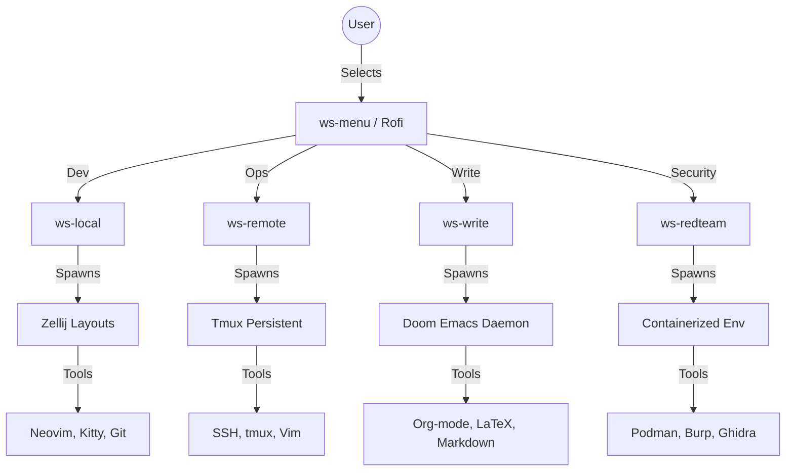

# Eco-Workflow System

Complete guide for the context-aware workflow system in S1Bs1Bs1stem.

## Table of Contents
- [Workflow Architecture](#workflow-architecture)
- [Workflow Profiles](#workflow-profiles)
- [Workflow Switching](#workflow-switching)
- [Workflow Menu](#workflow-menu)
- [Creating Custom Profiles](#creating-custom-profiles)
- [Profile Configuration](#profile-configuration)
- [Usage Examples](#usage-examples)
- [Integration](#integration)

---

## Workflow Architecture

### Overview

S1Bs1stem uses an **Eco-Workflow** system that adapts to your current work context. Instead of launching tools directly, you launch a **Context** that spawns the appropriate environment and tools.

### Core Philosophy

| Principle | Description |
|:---:|:---:|
| **Context Awareness** | Environment adapts to what you're doing |
| **Tool Selection** | Right tools for the job at hand |
| **Minimal Overhead** | No unnecessary background processes |
| **State Persistence** | Session continuation and restoration |
| **Fast Switching** | Instant context switching |

### How It Works



### Workflow Components

| Component | Purpose | Location |
|:---||---:|:---:|
| **Workflow Scripts** | `scripts/workflow/` | `~/.local/s1barch/workflow/` |
| **Workflow Profiles** | `workflow/profiles/` | `~/.local/s1barch/workflow/profiles/` |
| **Zellij Layouts** | `workflow/zellij/layouts/` | `~/.local/s1barch/workflow/zellij/layouts/` |
| **Workflow Menu** | `scripts/workflow/ws-menu.sh` | `~/Desktop/S1Bs1Bs1stem/scripts/workflow/` |
| **Switch Script** | `scripts/workflow/switch_workflow.sh` | `~/Desktop/S1Bs1Bs1stem/scripts/workflow/` |

---

## Workflow Profiles

### Overview

| Workflow | Engine | Purpose | Tools | Use Case |
|:---:---|:---:|:---:|
| **🖥️ Local Development** | **Zellij** | Coding, file management, local testing | Neovim, Kitty, Git, fzf, eza, bat | Development environment |
| **🌐 Remote Server** | **Tmux** | Server management, SSH sessions, persistent | Tmux, Vim, htop | Infrastructure and deployment |
| **📝 Deep Work** | **Emacs** | Distraction-free writing, documentation, planning | Doom Emacs, Yazi, LaTeX, Org-mode | Writing, research, academic work |
| **🛡️ Red Team** | **Zellij + Docker** | Security research, CTF, pentesting, Burp, Ghidra, Wireshark, Docker | Security assessments, exploitation |

---

### Profile Locations

All profiles are in `~/Desktop/S1Bs1Bs1stem/workflow/profiles/`:

| Profile | File | Description |
|:---:---|:---:|
| **local.md** | Local Development profile configuration |
| **remote.md** | Remote Server profile configuration |
| **write.md** | Deep Write profile configuration |
| **redteam.md** | Red Team profile configuration |

---

## Workflow Switching

### Switching Commands

| Method | Command | Description |
|:---:|---||:---:|
| **Direct Script** | `~/Desktop/S1Bs1Bs1stem/scripts/workflow/switch_workflow.sh local` | Switch to local workflow |
| | **Alias** | `ws-local` | Alias for local workflow |
| | **Menu** | `ws-menu` | Interactive menu to select workflow |
| | **Source** | `source ~/Desktop/S1Bs1Bs1stem/scripts/common/functions.sh` then switch_workflow local` | Source functions then switch |

### Switch Workflow

```bash
# Direct switch
~/Desktop/S1Bs1Bs1stem/scripts/workflow/switch_workflow.sh local

# Using aliases (after sourcing functions.sh)
ws-local      # Local Development
ws-remote     # Remote Server
ws-write       # Deep Write
ws-redteam     # Red Team
```

### Workflow Menu (Rofi)

Launch the workflow selection menu:

```bash
~/Desktop/S1Bs1Bs1stem/scripts/workflow/ws-menu.sh
```

This shows an interactive Rofi menu with workflow descriptions and keybindings.

---

## Workflow Menu (Rofi)

### Overview

The Rofi workflow menu provides:
- Visual workflow selection with icons
- Keyboard shortcuts for quick access
- Current workflow indication
- Search and filter workflows

### Launching

```bash
# Launch menu
~/Desktop/S1Bs1Bs1Bs1stem/scripts/workflow/ws-menu.sh
# Or with alias (if configured)
ws-menu
```

### Available Workflows

| Workflow | Shortcut | Icon | Engine | Use Case |
|:---::---:|:---:|:---:|
| **Local** | Alt+1 | 🖥️ | Zellij | Coding, development, testing |
| **Remote** | Alt+2 | 🌐 | Tmux | Server management, SSH |
| **Write** | Alt+3 | 📝 | Emacs | Writing, documentation |
| **Red Team** | Alt+4 | 🛡️ | Zellij+Docker | Security research, CTF |

### Menu Options

- Select workflow → Spawns the selected workflow
- Exit → Closes menu
- Search → Filter workflows
- Help → Show keyboard shortcuts

---

## Creating Custom Profiles

### Profile Structure

Each profile is a Markdown file in `workflow/profiles/`:

```markdown
# Profile Name

## Description
Brief description of this workflow's purpose

## Engine
Which terminal multiplexer to use

## Tools
List of tools included in this workflow

## Configuration
Configuration files and settings

## Keybindings
Important keybindings for this workflow

## Layouts
Zellij layouts to load (if using Zellij)

## Autostart
Applications that start automatically

## Environment Variables
Environment variables to set for this workflow
```

### Example: Custom Profile

```markdown
# Gaming Profile

## Description
Optimized for gaming, steam games, and game development

## Engine
Zellij with gamepad support

## Tools
- Steam
- Lutris
- Discord
- OBS Studio
- MangoHud
- nvim (game development)

## Configuration
```
- ~/.config/steam/config.vdf
- ~/.config/lutris/lutris.cfg
- ~/.config/obs/configuration.json
- ~/.config/mangohud/mangoHUD.cfg
```

## Keybindings
- F11: Fullscreen (Steam)
- F1: Take screenshot (OBS)
- Shift+Tab: Steam overlay
- Ctrl+Shift+M: MangoHud overlay

## Layouts
```
- gaming.kdl (Game-focused Zellij layout)
```

## Autostart
- discord
- steam
```

## Environment Variables
```
export GAME_MODE=1
export STEAM_COMPATIBLE=true
```
```

### Profile Best Practices

1. **Be Specific**: Each profile should have a clear purpose
2. **Keep It Focused**: Don't include unrelated tools
3. **Document Settings**: Explain why each configuration
4. **Include Keybindings**: Document all important shortcuts
5. **Set Environment Variables**: Define what the profile changes

---

## Profile Configuration

### Editing Profiles

Edit profiles directly:

```bash
# Edit local profile
nano ~/Desktop/S1Bs1Bs1stem/workflow/profiles/local.md

# Edit remote profile
nano ~/Desktop/S1Bs1Bs1stem/workflow/profiles/remote.md
# Edit write profile
nano ~/Desktop/S1Bs1Bs1stem/workflow/profiles/write.md

# Edit redteam profile
nano ~/Desktop/S1Bs1Bs1stem/workflow/profiles/redteam.md
```

### Profile Validation

Profiles are validated before loading:

```bash
# Check if profile exists
if [ -f "$PROFILE_PATH" ]; then
    source "$PROFILE_PATH"
else
    echo "Profile not found: $PROFILE_PATH"
    exit 1
fi
```

---

## Usage Examples

### Daily Workflow

```bash
# Morning: Start local development
ws-local

# Work time: Switch to remote
ws-remote

# Afternoon: Switch to deep work
ws-write

# Evening: Security research
ws-redteam
```

### Task-Based Workflow

```bash
# Programming session
ws-local
# Do some coding...
# Test with fzf...

# Security research
ws-redteam
# Scan target...
# Exploit found...
# Generate report...
```

### Context Switching

```bash
# From local to remote seamlessly
ws-remote

# From remote to deep write
ws-write

# From deep write to local
ws-local

# From any workflow to another
ws-local  # or any other profile
```

### Multi-Session Workflow

```bash
# Terminal 1: Local development
ws-local &
PID1=$!

# Terminal 2: Remote server
ws-remote &
PID2=$!

# Terminal 3: Write session
ws-write &
PID3=$!

# All 4 terminals running in parallel
```

---

## Integration

### With Window Manager

#### DWM Integration

Add workflow commands to `config.h`:

```c
// Keybindings for workflows
static const char *wslocal[] = { MOD1, XK_1, 0 };
static const char *wsremote[] = { MOD1, XK_2, 0 };
static const char *wswrite[] = { MOD1, XK_3, 0 };
static const char *wsredteam[] = { MOD1, XK_4, 0 };

// Bind in keys[] array
keys[0] = wslocal;
keys[1] = wsremote;
keys[2] = wswrite;
keys[3] = wsredteam;
```

#### Waybar Integration

Add workflow modules to `config`:

```ini
[module/workflow]
type = custom
exec = ~/Desktop/S1Bs1Bs1stem/scripts/workflow/ws-local.sh

[keybindings]
mod4 = exec ws-local
shift+mod4 = exec ws-remote
shift+mod3 = exec ws-write
shift+mod2 = exec ws-redteam
```

#### Rofi Integration

Add workflow launcher:

```bash
# Create Rofi launcher for workflows
#!/bin/bash
# Select workflow from Rofi menu
selected=$(echo -e "Local Development\nRemote Server\nDeep Write\nRed Team" | rofi -dmenu -p "Select Workflow:")

# Switch to selected workflow
case "$selected" in
    "Local Development")
        ~/.local/s1barch/scripts/workflow/switch_workflow.sh local
        ;;
    "Remote Server")
        ~/Desktop/S1Bs1Bs1stem/scripts/workflow/switch_workflow.sh remote
        ;;
    "Deep Write")
        ~/Desktop/S1Bs1Bs1Bs1stem/scripts/workflow/switch_workflow.sh write
        ;;
    "Red Team")
        ~/Desktop/S1Bs1Bs1stem/scripts/workflow/switch_workflow.sh redteam
        ;;
esac
        echo "Workflow cancelled"
        ;;
esac
```

### With Scripts

#### Audio Control in Workflows

```bash
# In write profile - lower volume
source ~/.local/s1barch/scripts/common/functions.sh
audio_volume_down

# In redteam profile - mute microphone
source ~/Desktop/S1Bs1Bs1stem/scripts/common/functions.sh
audio_mic_toggle_mute
```

#### Network Management in Workflows

```bash
# In remote profile - connect VPN
~/.local/s1barch/scripts/networking/vpn_connect.sh connect work_vpn.ovpn

# In redteam profile - connect Tailscale
~/Desktop/S1Bs1Bs1stem/scripts/networking/tailscale_toggle.sh on
```

---

## For More Information

- [Main README](../README.md)
- [Installation Guide](01_INSTALLATION.md)
- [DWM Setup Guide](02_DWM_SETUP.md)
- [Audio Management](03_AUDIO.md)
- [Battery Management](04_BATTERY.md)
- [Display Management](05_DISPLAY.md)
- [DWM Window Management](06_DWM_WINDOW_MANAGEMENT.md)
- [Networking](07_NETWORKING.md)
- [System Management](08_SYSTEM.md)
- [Troubleshooting](11_TROUBLESHOOTING.md)
- [API Reference](12_API_REFERENCE.md)
